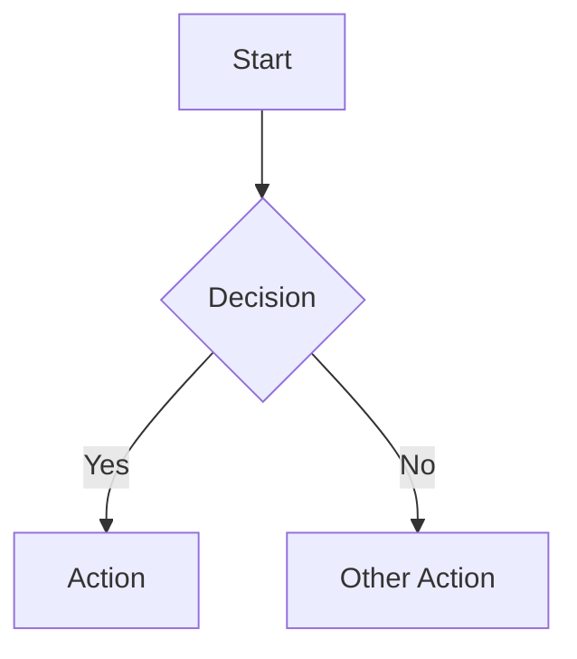
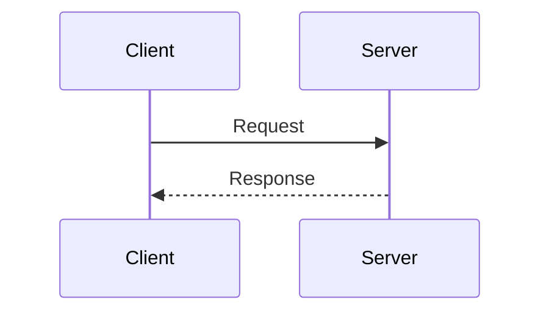

# Obsidian Markdown Syntax

Quick reference for Obsidian-specific markdown syntax used in the vault.

## Wiki-Links

Obsidian uses wiki-links for internal note references. These create bidirectional links between notes.

### Basic Link

```markdown
[[note-name]]
```

Links to `note-name.md` in the vault. Obsidian resolves the path automatically.

### Link with Display Text

```markdown
[[note-name|Display Text]]
```

Renders as "Display Text" but links to `note-name.md`.

### Link to Heading

```markdown
[[note-name#Heading Name]]
```

Links to a specific heading within the target note.

### Link to Heading with Display Text

```markdown
[[note-name#Heading Name|Display Text]]
```

### Link to Block

```markdown
[[note-name#^block-id]]
```

Links to a specific block (paragraph) that has been given an ID with `^block-id` at the end.

### Embedding

```markdown
![[note-name]]
![[image.png]]
```

Embeds the entire content of another note or an image inline.

## Callouts

Callouts are styled blockquotes for highlighting information.

### Syntax

```markdown
> [!type] Optional Title
> Content of the callout.
> Can span multiple lines.
```

### Available Types

#### Note
```markdown
> [!note] Title
> General information or context.
```

#### Tip
```markdown
> [!tip] Title
> Helpful advice or best practices.
```

#### Warning
```markdown
> [!warning] Title
> Potential pitfalls or things to watch out for.
```

#### Important
```markdown
> [!important] Title
> Critical information that must not be overlooked.
```

#### Example
```markdown
> [!example] Title
> A concrete example or demonstration.
```

### Foldable Callouts

Add `+` (default open) or `-` (default closed) after the type:

```markdown
> [!tip]- Click to expand
> Hidden content here.
```

## Properties / Frontmatter

YAML metadata at the top of a note, delimited by `---`.

```markdown
---
title: Note Title
date: 2026-02-09
tags:
  - tag-one
  - tag-two
status: draft
type: research
---
```

**Rules:**
- Must be the very first thing in the file (no blank lines before it).
- Delimited by exactly `---` on its own line.
- Valid YAML syntax inside.
- Obsidian renders these as editable properties in the UI.

## Tags

### Frontmatter Tags

```yaml
tags:
  - topic/networking
  - lang/typescript
```

### Inline Tags

```markdown
This paragraph is about #networking and #typescript.
```

### Nested Tags

Use `/` to create tag hierarchies:

```markdown
#lang/typescript
#topic/security/authentication
```

**Convention:** Prefer frontmatter tags over inline tags for consistency. Use inline tags sparingly for emphasis within body text.

## Task Lists

```markdown
- [ ] Incomplete task
- [x] Completed task
- [ ] Task with a [[link-to-note]]
```

Obsidian tracks task completion and can query tasks across the vault.

## Comments

Obsidian comments are hidden in both edit and preview mode:

```markdown
%% This is a comment that won't render %%

%%
Multi-line comments
are also supported.
%%
```

Use comments for:
- Notes to yourself about the structure
- TODO reminders that shouldn't appear in the rendered note
- Placeholders for future content

## Code Blocks

### Inline Code

```markdown
Use `backticks` for inline code.
```

### Fenced Code Blocks

````markdown
```language
code here
```
````

Always specify the language identifier for syntax highlighting:

````markdown
```typescript
const greeting: string = "hello";
```
````

````markdown
```bash
git pull --rebase
```
````

````markdown
```yaml
key: value
```
````

## Mermaid Diagrams

Obsidian supports Mermaid diagrams natively:

````markdown

````

````markdown

````

Use Mermaid for architecture diagrams, flowcharts, sequence diagrams, and other visual representations within notes.

## Tables

Standard markdown tables:

```markdown
| Header 1 | Header 2 | Header 3 |
|---|---|---|
| Cell 1 | Cell 2 | Cell 3 |
| Cell 4 | Cell 5 | Cell 6 |
```

Alignment:

```markdown
| Left | Centre | Right |
|:---|:---:|---:|
| text | text | text |
```

## Horizontal Rules

```markdown
---
```

Use sparingly. Prefer headings for section breaks.

## Footnotes

```markdown
This has a footnote[^1].

[^1]: Footnote content here.
```

## Highlights

```markdown
==highlighted text==
```

Renders with a yellow background in Obsidian.

## Strikethrough

```markdown
~~strikethrough text~~
```
